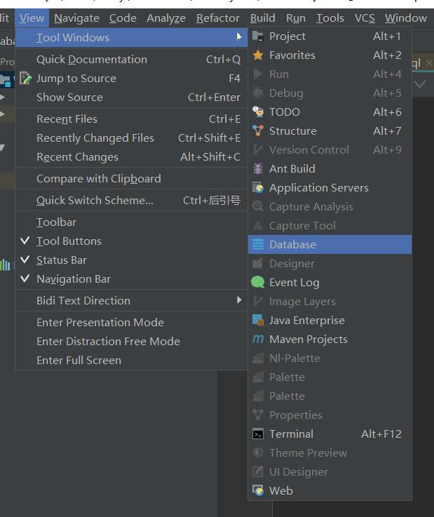

# idea连接mysql
## 1. database tool
- 主界面[view]-[tool windows]-[database]

## (2. driver)
- 选择[mysql] 点击[driver]旁mysql安装驱动

## 3. 连接mysql
输入[Host]、[Database]、[User]、[Password] 点击[Test Connection]显示Successful则连接成功
